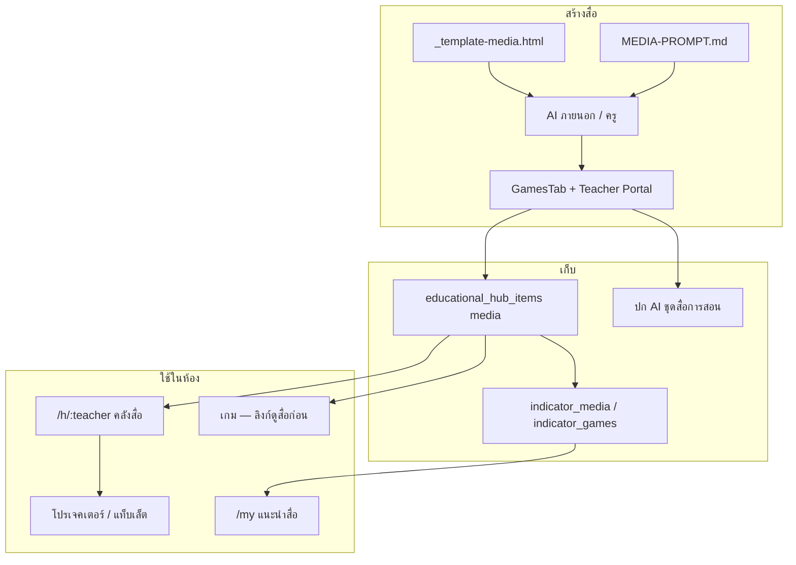

# แผนพัฒนาระยะยาว — คลังสื่อการสอน (kampai-school)

> อัปเดต: 2026-07-29  
> ขอบเขต: หมวด **คลังสื่อการสอน** (`category_key = 'media'`) + worksheets / videos + **lesson_packs**  
> เอกสารคู่: [`ไอเดียทำสื่อ.md`](./ไอเดียทำสื่อ.md) · [`แผนสื่อตามตัวชี้วัด.md`](./แผนสื่อตามตัวชี้วัด.md) · [`MEDIA-PROMPT.md`](./public/MEDIA-PROMPT.md)

---

## สถานะล่าสุด (Phase 16 — habit + pack surface)

| Phase | สถานะ | สิ่งที่ได้ |
|------|--------|-----------|
| **11–15** | ✅ | คู่สื่อ+ใบงาน · แนะนำ · ครูอัป · lesson packs · parent worksheets |
| **16** | 🟡 กำลังทำ | packs ในคลังสาธารณะ/ครู · KPI ครู non-admin · มอบหมายบ้านจาก pack · coverage KPI |

**ช่องว่างที่เหลือ (หลัง ship Phase 16 โค้ด):**

```
- หลักฐานครู non-admin อัปจริง (มี KPI ใน SystemOverview แล้ว — รอจำนวน > 0)
- coverage ตัวชี้วัดเกม+สื่อ ทั้งหลักสูตร ≥80% (เติมต่อใน IndicatorCoverageDialog)
```

---

## สถานะล่าสุดย้อนหลัง (Phase 11–15 ปิดแล้ว)

| Phase | สถานะ | สิ่งที่ได้ |
|------|--------|-----------|
| **11** thin subjects | ✅ | ศิลปะ×3 · การงาน×3 · เทค×2 · สังคม×2 (+10 คู่ · mig 432) |
| **12** ป.ต้น daily-use | ✅ | ไทย×3 · คณิต×3 · อังกฤษ×2 · วิทย์×2 (+10 คู่ · mig 433) |
| **13** ป.6 + ตัวชี้วัด | ✅ | ร้อยละ สมการ วรรณคดี ไฟฟ้า ระบบย่อย tense reading เศรษฐศาสตร์ (+8 คู่ · mig 434) |
| **14** แนะนำ + ครูอัป | ✅ | `recommend_media` · `/my` · ดูสื่อก่อน · `/teacher/edu-hub` + W8 |
| **15** lesson packs | ✅ | `lesson_packs` ≥30 · `/parent/worksheets` กรองชั้นลูก · mig 435 |

**นับประมาณ:** สื่อ media publish ≫ 40 · ใบงานคู่ครบ Phase 11–13 · ปก PNG คู่ใหม่ครบ 28/28 · lesson packs ≥30

---

## 1. วิสัยทัศน์ (3 ปี)

**ครูเปิดคลังสื่อแล้วสอนได้ทันทีบนโปรเจคเตอร์/แท็บเล็ต — ครบทุกสาระหลัก ป.1–6 · ผูกตัวชี้วัด · แนะนำให้นักเรียนอัตโนมัติ**

| ปีที่ | เป้าหมายหลัก |
|------|----------------|
| **ปี 1** | แกน HTML interactive ครบ 4 วิชาหลัก (คณิต ไทย อังกฤษ วิทย์) + ครูอัป PDF/YouTube เองได้ |
| **ปี 2** | ทุกสื่อผูกตัวชี้วัด · แนะนำสื่อใน Student/Parent/Teacher mastery · ใบงานพิมพ์ได้ |
| **ปี 3** | ครูหลายคนสร้างสื่อเองเป็นกิจวัตร · คลังเป็น “ห้องสมุดดิจิทัลโรงเรียน” ไม่พึ่ง dev ทุกชิ้น |

---

## 2. สถานะปัจจุบัน (จุดตั้งต้น)

### มีแล้ว

| ชั้น | สิ่งที่มี |
|------|----------|
| **แพลตฟอร์ม** | educational-hub · media/games/worksheets/videos · Teacher Portal · lesson_packs · ปก AI |
| **เครื่องมือสร้าง** | `_template-media.html` · `MEDIA-PROMPT.md` · GamesTab · publish checklist |
| **สื่อ interactive** | Phase 11–13 ครบ + batches เก่า (เศษส่วน สูตรคูณ สระ มาตรา วัฏจักรน้ำ ฯลฯ) |
| **ระบบแนะนำ** | `recommend_games` + `recommend_media` บน `/my` · ปุ่มดูสื่อก่อนบนเกม |
| **ผู้ปกครอง** | `/parent/worksheets` กรองตามชั้นลูก + ชุดเรียน |

### ช่องว่างที่เหลือ (หลัง Phase 15 → เปิด Phase 16)

```
- ครู non-admin อัปสื่อเป็นกิจวัตร (มีช่องทาง+KPI แล้ว — รอหลักฐานใช้งานจริง)
- coverage ตัวชี้วัดเกม+สื่อ ≥80% ทั้งหลักสูตร (เติมต่อเนื่องใน IndicatorCoverageDialog)
```

**Phase 16 ship (2026-07-29):** packs โผล่ใน `/educational-hub` + หน้าครู · มอบหมายจาก pack · parent ฝึกแล้ว/ส่งงาน · ขยายคู่เกม↔สื่อ · KPI ใน SystemOverview

**Salvage 2026-07-28:** ดึง orphan จาก worktree ที่หล่นตอน rebase เข้า git แล้ว (Batch 9–13 · Media Y/Z/AA · pet · mig 436–445) — ไม่นับเป็น Phase ใหม่

**นับปัจจุบัน:** ดูตารางสถานะ Phase 11–16 ด้านบน · ไม่ใช้ตัวเลข ~11 ชิ้นเดิมแล้ว (stale)

---

## 3. หลักการออกแบบระยะยาว

1. **สื่อ ≠ เกม** — สาธิต/ฝึกในห้อง ไม่ไล่คะแนน LB (เกมอยู่หมวด games)
2. **คู่เกมก่อนสร้างใหม่** — มีเกมแล้ว → แตกสื่ออธิบายก่อนเล่น (ลดงานซ้ำเนื้อหา)
3. **เทมเพลต + AI ก่อนเขียนมือ** — ใช้ `_template-media` + MEDIA-PROMPT เป็นค่าเริ่มต้นทุกชิ้น
4. **โปรเจคเตอร์เฟิร์ส** — ปุ่มใหญ่ ตัวอักษรใหญ่ ไม่บังคับกล้อง/ล็อกอิน
5. **metadata บังคับ** — ชื่อ · คำอธิบาย · วิชา · ชั้น · ปก · tags ก่อน publish
6. **หลักสูตรเป็นเข็มทิศ** — ปี 2+ ทุกสื่อใหม่ต้องมีตัวชี้วัดอย่างน้อย 1 ตัว

---

## 4. แผนตามช่วงเวลา

### ระยะใกล้ — Q3–Q4 2026 (เติมแกน + นิสัยครู)

**เป้า:** ทุกวิชาหลักมีสื่อ interactive ≥ 2 ชิ้น · ครูอัปไฟล์เองได้

| สัปดาห์/เดือน | งาน | สำเร็จเมื่อ |
|---------------|-----|------------|
| ทันที–1 เดือน | ~~**M2** ตารางสูตรคูณ · **S1** วัฏจักรน้ำ · **T2** มาตราตัวสะกด~~ ✅ | เสร็จ migration 321–323 |
| **สัปดาห์ 1–2 ก.ค.** | **M1** เส้นจำนวน · **E2** Sight words · **S2** แผนภาพระบบย่อย | HTML + seed + ปก 📚 |
| สัปดาห์ 3–4 ก.ค. | **O3** ล้างมือ 7 ขั้น · **W8** คู่มือครู 1 หน้า · metadata สื่อเดิม | คู่เกม + ครูอัปเองได้ |
| คู่ขนาน | เฟส 1 Quick wins: PDF/YouTube วิชาละ ≥1 · ใบงาน M8 คู่ rounding | หมวด worksheets/videos มีของจริง |
| คงที่ | ทุกชิ้นใหม่ใช้เทมเพลต + ปก **📚 สื่อการสอน** | ไม่มีสื่อจอดำ/ไม่มีปก |

**ตัวชี้วัดระยะใกล้**

- [x] สื่อ media ที่ publish ≥ **12** ชิ้น — **~13 ชิ้น** (ผ่านเป้า)
- [x] ครอบคลุมวิชา: คณิต ไทย อังกฤษ วิทย์ (อย่างน้อยวิชาละ 2) — **ผ่าน**
- [ ] ครูอย่างน้อย 1 คนนอก admin อัปสื่อผ่าน `/teacher/edu-hub` — **ยังไม่มีหลักฐาน**

---

### ระยะกลาง — 2027 H1 (หลักสูตร + เส้นทางเรียน)

**เป้า:** สื่ออยู่ในระบบ mastery / แนะนำเกม–สื่ออัตโนมัติ

| งานระบบ | รายละเอียด |
|---------|------------|
| **W6 ผูกตัวชี้วัด** | ขยาย `indicator_games` หรือตาราง `indicator_media` ให้ map สื่อได้ |
| **แนะนำสื่อ** | `recommend_games` → รวม media (หรือ RPC `recommend_media`) ใน `/my` และ Teacher heatmap |
| **ชุดเรียน “ก่อนเล่นเกม”** | หน้าเกมแสดง “ดูสื่อก่อน” ถ้ามีสื่อคู่ (เช่น sara-run → thai-sara-chart) |
| **W7 ใบงานพิมพ์** | จากสื่อ HTML → พิมพ์/PDF หมวด worksheets |
| **W4 checklist publish** | บังคับ metadata ก่อนเผยแพร่ |

| งานเนื้อหา | รายละเอียด |
|------------|------------|
| เติม **M4–M6** (นาฬิกา เงิน เรขา) · **T3–T5** · **E3** · **S3–S4** · **O1 O3 O4** | ตาม backlog ใน `ไอเดียทำสื่อ.md` |
| สื่อคู่เกมครบชุดหลัก | handwash, digestive, waste-sort, math-hand-raising |

**ตัวชี้วัดระยะกลาง**

- [x] ≥ **80%** ของสื่อ media ใหม่ Phase 11–13 มี `grade_levels` + ตัวชี้วัดอย่างน้อย 1
- [x] นักเรียนเห็นสื่อแนะนำใน `/my` ได้จริง — RecommendedMedia + recommend_media (429)
- [x] สื่อ media ที่ publish ≥ **25** ชิ้น — ผ่านแล้ว (Phase 11–13 + batches เก่า)

---

### ระยะยาว — 2027 H2 – 2028 (โรงเรียนเป็นเจ้าของคลัง)

**เป้า:** ครูสร้างสื่อเองเป็นหลัก · dev โฟกัสแพลตฟอร์ม

| งาน | รายละเอียด |
|-----|------------|
| **สตูดิโอสื่อเบา** | ฟอร์มสร้างสื่อจากเทมเพลตในแอดมิน (เลือกวิชา/ชั้น → generate scaffold) |
| **ห้องสมุดไอเดียครู** | แชร์สื่อข้ามครู (อ่านอย่างเดียว / fork) — แนว SelfDevelopmentHub |
| **มาตรฐานคุณภาพ** | รีวิวปก + metadata + เล่นบนมือถือผ่าน checklist อัตโนมัติ (คล้าย `verify:game` แต่เบาลง = `verify:media`) |
| **รายงานการใช้** | view_count / เวลาเปิดสื่อ ต่อชั้นเรียน (ครูเห็นว่าสื่อไหนถูกใช้สอนจริง) |
| **ครอบคลุม ป.1–6 ครบสาระ** | รวมสังคม สุขศึกษา ศิลปะ การงาน (อย่างน้อยแผนภาพ/YouTube ต่อสาระ) |

**ตัวชี้วัดระยะยาว**

- [ ] ≥ **50%** ของสื่อใหม่ในรอบปีมาจากครู (ไม่ใช่ dev)
- [ ] ทุกสาระหลักมีสื่อ ≥ 1 ต่อช่วงชั้น (ป.ต้น / ป.ปลาย)
- [ ] สื่อ media ที่ publish ≥ **40** ชิ้น

---

## 5. แผนที่เนื้อหาเป้าหมาย (Coverage Map)

เป้าหมายขั้นต่ำต่อช่วงชั้น — ใช้ติ๊กเมื่อครบ

### คณิตศาสตร์

| ช่วง | เป้าหมายสื่อ | สถานะ |
|------|-------------|--------|
| ป.1–2 | เส้นจำนวน · นาฬิกา · เงินไทย | 🟡 สูตรคูณ ✅ (ป.2–4) · เส้นจำนวน **ถัดไป (M1)** |
| ป.3–4 | สูตรคูณ · เศษส่วนวงกลม/แท่ง | ✅ สูตรคูณ + เศษส่วน |
| ป.5–6 | ค่าประมาณ · กราฟ/แผนภูมิ | 🟡 ค่าประมาณ ✅ |

### ภาษาไทย

| ช่วง | เป้าหมายสื่อ | สถานะ |
|------|-------------|--------|
| ป.1–2 | สระ · มาตราตัวสะกด | ✅ สระ + มาตรา |
| ป.3–4 | ชนิดของคำ · โครงสร้างประโยค | ✅ ชนิดของคำ (T3) |
| ป.5–6 | ไวพจน์ · vocab hub | 🟡 vocab ✅ |

### ภาษาอังกฤษ

| ช่วง | เป้าหมายสื่อ | สถานะ |
|------|-------------|--------|
| ป.1–2 | Phonics · Sight words | 🟡 Phonics ✅ · **Sight words ถัดไป (E2)** |
| ป.3–4 | Grammar mini | ✅ Grammar Mini (E3) |
| ป.5–6 | vocab hub | 🟡 vocab ✅ |

### วิทยาศาสตร์ / อื่น ๆ

| ช่วง | เป้าหมายสื่อ | สถานะ |
|------|-------------|--------|
| ป.3–5 | วัฏจักรน้ำ · สสาร · โซ่อาหาร | 🟡 วัฏจักรน้ำ ✅ |
| ป.4–6 | ระบบย่อย · ร่างกาย | 🟡 **ระบบย่อย ถัดไป (S2)** คู่ digestive-ar |
| ข้ามชั้น | ล้างมือ · คัดแยกขยะ · แผนที่ไทย | 🟡 ล้างมือ **คิวสัปดาห์ 3 (O3)** |

---

## 6. สถาปัตยกรรมเป้าหมาย



### กฎทางเทคนิค (คงที่)

| กฎ | ค่า |
|----|-----|
| หมวด | `category_key = 'media'` |
| `tracked_game` | `false` |
| path | `public/games/{subject}/{slug}.html` (หรือ `media/` ถ้าแยกทีหลัง) |
| ปก | PNG 1280×720 · ชุด **📚 สื่อการสอน** · `object-contain` ในการ์ด (ต่างจากปกเกม full-bleed) |
| กลับ | `/h/nattapong` หรือ hub ครูเจ้าของ |
| ตรวจ | responsive · ไม่มี LB/คะแนนบังคับ · TTS optional |

---

## 7. ลำดับความสำคัญถาวร (เมื่อเลือกงานถัดไป)

เรียงจากบนลงล่างทุกครั้งที่เลือกงานใหม่:

1. **ช่องว่างวิชาที่ยังศูนย์** (ตอนนี้ = วิทย์ / สังคม)
2. **สื่อคู่เกมยอดนิยม** (traffic สูงใน hub)
3. **ป.ต้น ใช้บ่อยทุกวัน** (สูตรคูณ · มาตรา · sight words)
4. **งานระบบที่คูณผล** (map ตัวชี้วัด · แนะนำสื่อ · verify:media)
5. **Polish สื่อเดิม** (โหมดฝึก · เสียง · ชั้นย่อย) — ทำเมื่อแกนครบแล้ว

---

## 8. ความเสี่ยงและทางเลี่ยง

| ความเสี่ยง | ทางเลี่ยง |
|------------|-----------|
| สร้าง HTML ช้า / พึ่ง dev | ย้ำเทมเพลต + MEDIA-PROMPT · รับ PDF/YouTube เป็นสื่อชั้นหนึ่ง |
| สื่อกับเกมปนกัน | ตรวจ `tracked_game` + หมวดตอน seed · UI แยกการ์ดชัด |
| ไม่มีคนใช้ | คู่เกม + ลิงก์จากหน้าเกม · อบรมครูสั้น · ใส่ในแผนการสอน |
| metadata ว่าง | checklist publish (W4) · seed บังคับ subject/grade |
| คุณภาพเสียง TTS ไม่นิ่ง | cue แบบ “a as in apple” / “สระอา เช่น มา” · อนาคตอัปคลิปเสียงจริงถ้าจำเป็น |

---

## 9. คิวงานถัดไป (อัปเดต 2026-07-08)

จากหลักข้อ 7 — **Sprint ก.ค. 2026:**

| ลำดับ | งาน | ประเภท | เป้าเสร็จ |
|------|-----|--------|-----------|
| **1** | สตูดิโอสื่อเบา / ครูสร้างเองเป็นกิจวัตร | ระบบ | ระยะยาว |
| **2** | อบรมครูอัปสื่อจริง + รายงานการใช้ | การนำไปใช้ | ระยะกลาง |
| — | ~~**แนะนำสื่อใน `/my`**~~ | ✅ `recommend_media` · mig 429 · RecommendedMedia |
| — | ~~**Batch AA** (O2/S5/E4/T6)~~ | ✅ apply 430 |
| — | ~~**W4** metadata ก่อนเผยแพร่~~ | ✅ EduHubItemForm v1.191 |
| — | ~~**W8** คู่มือครูอัปสื่อ + ความรู้สั้นวิชาละ 1~~ | ✅ migration 428 · `/docs/teacher-upload-media-guide.html` |
| — | ~~**"ดูสื่อก่อน"** บนหน้าเกม~~ | ✅ `edu-hub-game-media-pairs` + PreGamePanel |
| — | ~~**Batch Z** (M6 geometry-3d)~~ | ✅ migration 428 |
| — | ~~**S3** สถานะของสสาร~~ | ✅ มี `states-of-matter.html` (mig 336) — ปิดเอกสาร |
| — | ~~**Batch Y** (E2/M4/M5 · brush-teeth · light-properties)~~ | ✅ migration 427 |
| — | ~~**E2** Sight words ป.1–3 · **M4** นาฬิกา · **M5** เงินไทย~~ | ✅ migration 427 |
| — | ~~**Batch X** (H1/A1/T4 · plant/moon/area · bone/jobs/suff/dict)~~ | ✅ migration 380–381 |
| — | ~~**T5** โครงสร้างประโยค~~ | ✅ migration 376 |
| — | ~~**S4** ห่วงโซ่อาหาร~~ | ✅ migration 376 |
| — | ~~**O4** คัดแยกขยะ~~ | ✅ migration 376 |
| — | ~~**M1** เส้นจำนวน · **S2** ระบบย่อย · **O3** ล้างมือ~~ | ✅ migration 339 |
| — | ~~**T3** ชนิดของคำ~~ | ✅ migration 335 |
| — | ~~**E3** Grammar mini~~ | ✅ migration 335 |
| — | ~~M2 ตารางสูตรคูณ~~ | ✅ migration 322 |
| — | ~~S1 วัฏจักรน้ำ~~ | ✅ migration 321 |
| — | ~~T2 มาตราตัวสะกด~~ | ✅ migration 323 |
| — | ~~**W6** ผูกตัวชี้วัดสื่อ~~ | ✅ migration 340–341 · 376–377 · 380–381 |

### Definition of Done ต่อ 1 ชิ้นสื่อ

1. `public/games/{subject}/{slug}.html` จาก `_template-media.html`
2. Migration seed `category_key='media'` · `tracked_game=false`
3. ปก 1280×720 ชุด **📚 สื่อการสอน**
4. `description` + `grade_levels` + `tags` ครบ
5. ทดสอบจอโปรเจคเตอร์ + มือถือ · ไม่มีคะแนน/LB

รายละเอียดรายชิ้นอยู่ที่ [`ไอเดียทำสื่อ.md`](./ไอเดียทำสื่อ.md)

---

## 10. การทบทวนแผน

- ทบทวนแผนนี้ทุก **สิ้นเทอม** (หรือเมื่อสื่อครบเป้าช่วงนั้น)
- อัปตาราง Coverage Map + คิวข้อ 9 ใน commit เดียวกับงานสื่อใหญ่
- อย่าขยาย scope ปี 3 ก่อนเป้าปี 1–2 ผ่านตัวชี้วัด

---

## อ้างอิงด่วน

| เอกสาร | ใช้เมื่อ |
|--------|---------|
| `ไอเดียทำสื่อ.md` | เลือกชิ้นงาน / ติ๊กเสร็จ |
| `public/MEDIA-PROMPT.md` | สั่ง AI สร้างสื่อ |
| `public/games/_template-media.html` | scaffold ชิ้นใหม่ |
| `แผนพัฒนาคลังสื่อ.md` (ไฟล์นี้) | ทิศทางระยะยาว / จัดลำดับความสำคัญ |
